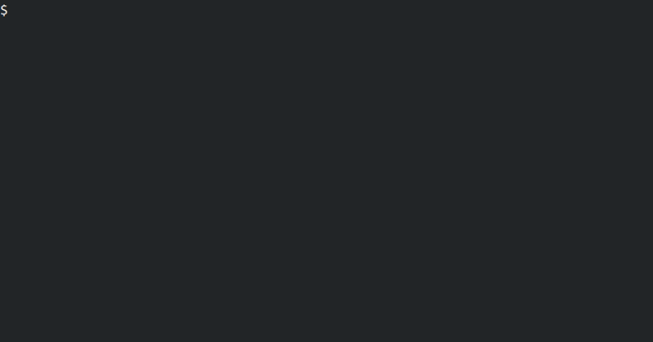

# fridar

Wrapper on frida to dynamically analyse Android apps.

### Demo

You can find some useful scripts at: https://github.com/iddoeldor/frida-snippets

### Todo

- [ ] Remove 'package name:' prompt from classes.js
- [ ] Add finished script (press ctrl-C) to return message to all frida scripts.
- [ ] Add script to `call` methods.
- [ ] Add script to revert implementation?
- [ ] Add script info `fridar> what script-name`.
- [ ] Add script to print / change variables.
- [ ] Add script to unpin SSL certificates.
- [ ] Add version command.
- [x] Refresh process list.

